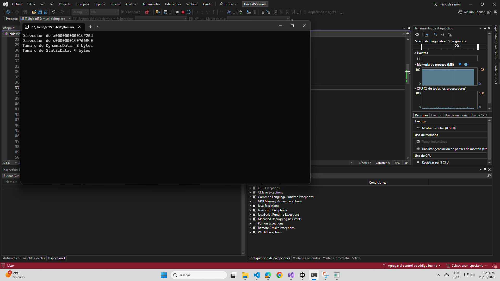

## Introducción a los Objetos

1.1 Considera el siguiente caso de estudio:

```cpp

class Particle {
public:
    float x, y;
    void move(float dx, float dy) {
        x += dx;
        y += dy;
    }
};

```

- ¿Qué representa la clase Particle?

R/ La clase Particle representa un modelo de una particula 2D en el que su estado es su posición en los planos X y Y. Acorde a la inteligencia artificial (ChatGPT), es util para simulaciones o juegos en donde un objeto "vive" en un punto plano y puede moverse.

- ¿Cómo interactúan sus atributos y métodos?

R/ En ese fragmento, por parte de los atributos, float x, y representan el estado de la particula y son variables miembro, es decir, cada objeto particle cuenta con su X y Y,
Y por parte de los métodos:

void move(float dx, float dy) {
    x += dx;
    y += dy;
}

El metodo depende del estado, es decir, move si o si necesita X y Y con valores, cuando se ejecuta move, cambia el estado (modifica X y Y).

En pocas palabras, los atributos son los datos y el método es el comportamiento de los datos.

- Prompt para ChatGPT: explícame en detalle qué es un objeto en C++ y cómo se relaciona con una clase. Usa el ejemplo de una clase Particle con atributos `x` y `y` y un método `move`.

R/

## Explorando la memoria

1.2 Considera los siguientes pasos:

- Crear instancias:

```cpp

Particle p1;
Particle p2;

```

- Explorar la memoria usando punteros:

```cpp

std::cout << "Dirección de p1: " << &p1 << std::endl;
std::cout << "Dirección de p2: " << &p2 << std::endl;

```

- Determinar el tamaño del objeto:

```cpp

std::cout << "Tamaño de Particle: " << sizeof(Particle) << " bytes" << std::endl;

```

- Imprimir direcciones de atributos:

```cpp

std::cout << "Dirección de p1.x: " << &(p1.x) << std::endl;
std::cout << "Dirección de p1.y: " << &(p1.y) << std::endl;

```

### Reflexión Guiada:

- ¿Los atributos están almacenados de forma contigua?

R/

- ¿Qué indica el tamaño del objeto sobre su estructura interna?

R/

- Prompt para ChatGPT: ¿Cómo se almacenan los objetos en memoria en C++? Si tengo dos instancias de Particle, ¿Cómo se relacionan sus direcciones de memoria? ¿Los atributos están contiguos?

R/


## Análisis de diferencias

1.3 Crear clases con diferentes atributos y métodos:

```cpp

class Simple {
public:
    int a;
};

class Complex {
public:
    int a, b, c;
    void method1() {}
    void method2() {}
};

```
​
-Compara los tamaños:

```cpp

std::cout << "Tamaño de Simple: " << sizeof(Simple) << " bytes" << std::endl;
std::cout << "Tamaño de Complex: " << sizeof(Complex) << " bytes" << std::endl;

```​


- Agregar datos estáticos y dinámicos:

```cpp

class StaticData {
public:
    static int s;
    int a;
};

int StaticData::s = 0;

class DynamicData {
public:
    int* ptr;
    DynamicData() {
        ptr = new int[10];
    }
    ~DynamicData() {
        delete[] ptr;
    }
};

```


 

NOTA: un metodo se crea en.text, cuando uso un metodo virtual, se crea un puntero virtual cuando se hace un metodo virtual

NOTA: Complex ocupa 12 bytes, metodo no ocupan espacio en la misma, Static modifica el tiempo de vida de la variable: la clase cuando se crea una instancia, todos los atributos tendran el mismo valor; pueden existir si no hay instancias de la clase; el timepo de vida es mayor al de esas clases.

- ¿Cómo afectan los datos estáticos al tamaño de la instancia?

R/ En este caso, si lo vemos desde diferentes apartados, los métodos no afectan el tamaño de la instancia, las datos estaticos tampoco, los unicos que ueden llegar a afectar, son los datos dinamicos, pero solo aplica con los punteros.

- ¿Qué diferencias hay entre datos estáticos y dinámicos en términos de memoria?

R/ En terminos de memoria, hay varias diferencias: los datos estaticos se almacenan en la sección de datos estaticos y existen desde qe comienza hasta que finaliza el programa; por otro lado, los datos dinamicos se almacenan en el heap y el tiempo depende de hasta que se llame un delete o free.

- Prompt para ChatGPT: explícame cómo el uso de variables estáticas y dinámicas en una clase afecta el tamaño de sus instancias. ¿Las variables estáticas ocupan espacio en cada objeto?


## Reflexión

Documenta en tu bitácora de aprendizaje:

- ¿Qué es un objeto desde la perspectiva de la memoria?
- ¿Cómo influyen los atributos y métodos en el tamaño y estructura del objeto?
- Conclusión: resumir los hallazgos y cómo esto impacta el diseño de clases.