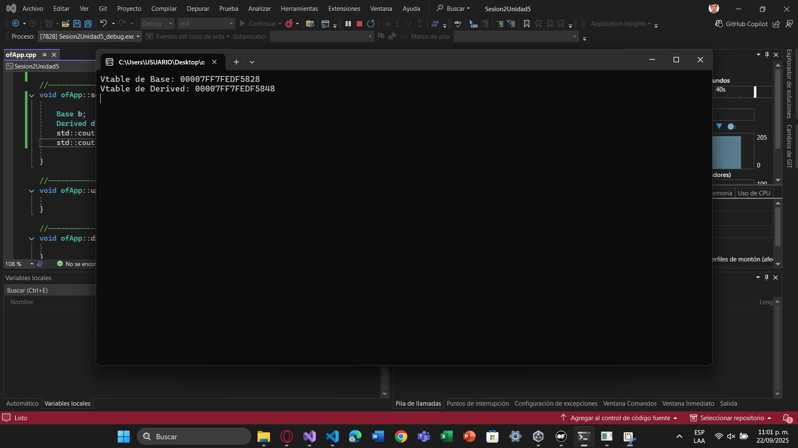

## Exploración de métodos virtuales

Considera los siguientes pasos:

2.1 Crea una jerarquía de clases con métodos virtuales:

```cpp

class Base {
public:
    virtual void display() {
        std::cout << "Base display" << std::endl;
    }
};

class Derived : public Base {
public:
    void display() override {
        std::cout << "Derived display" << std::endl;
    }
};

```

- Analiza la vtables. ¿En qué parte de la memoria se encuentran las vtable de cada objeto?

```cpp

Base b;
Derived d;
std::cout << "Vtable de Base: " << *(void**)&b << std::endl;
std::cout << "Vtable de Derived: " << *(void**)&d << std::endl;

```

- ¿Cómo afecta la presencia de métodos virtuales al tamaño del objeto?


- ¿Qué papel juegan las vtables en el polimorfismo?


- Prompt para ChatGPT: ¿Cómo se implementan los métodos virtuales en C++? Explica el concepto de vtable y cómo se utiliza para resolver llamadas a métodos virtuales.




## Uso de punteros y referencias

2.1. Implementar una clase con punteros a funciones:

```cpp

class FunctionPointerExample {
public:
    void (*funcPtr)();
    static void staticFunction() {
        std::cout << "Static function called" << std::endl;
    }
    void assignFunction() {
        funcPtr = staticFunction;
    }
};

```

### Analizar el impacto en memoria:

- Observar si el tamaño de la instancia cambia al usar punteros a funciones.


- Verificar cómo se almacenan estos punteros.


## Reflexión Guiada:

- ¿Cuál es la relación entre los punteros a métodos y la vtable?


- ¿Cómo afectan estos mecanismos al rendimiento del programa?


- Prompt para ChatGPT: ¿Qué diferencia hay entre punteros a funciones y punteros a métodos miembro en C++? ¿Cómo afectan al tamaño de los objetos y al rendimiento?


## Reflexión individual:

- ¿Dónde residen los datos y métodos de una clase en la memoria?


- ¿Cómo interactúan las diferentes partes en tiempo de ejecución?


- Conclusión: cómo esta comprensión afecta el diseño de sistemas.