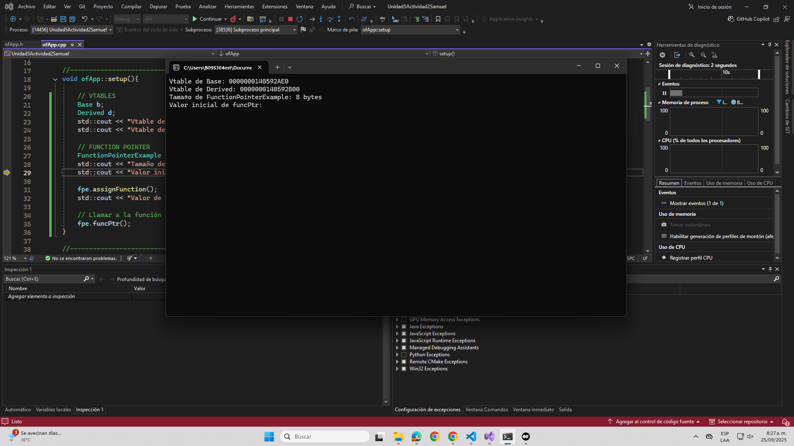

## Exploración de métodos virtuales

Considera los siguientes pasos:

2.1 Crea una jerarquía de clases con métodos virtuales:

```cpp

class Base {
public:
    virtual void display() {
        std::cout << "Base display" << std::endl;
    }
};

class Derived : public Base {
public:
    void display() override {
        std::cout << "Derived display" << std::endl;
    }
};

```

- Analiza la vtables. ¿En qué parte de la memoria se encuentran las vtable de cada objeto?

R/ Las vtables se encuentran en la memoria estática del ejecutable.

```cpp

Base b;
Derived d;
std::cout << "Vtable de Base: " << *(void**)&b << std::endl;
std::cout << "Vtable de Derived: " << *(void**)&d << std::endl;

```

- ¿Cómo afecta la presencia de métodos virtuales al tamaño del objeto?

R/ Los métodos virtuales aumentan el tamaño del objeto porque añaden un puntero oculto (vptr).

- ¿Qué papel juegan las vtables en el polimorfismo?

R/ Las vtables permiten el polimorfismo dinámico: en tiempo de ejecución, deciden qué implementación llamar según la clase real del objeto.

- Prompt para ChatGPT: ¿Cómo se implementan los métodos virtuales en C++? Explica el concepto de vtable y cómo se utiliza para resolver llamadas a métodos virtuales.

R/ 

Los métodos virtuales en C++ se implementan mediante una tabla de funciones virtuales (vtable) y un puntero oculto en cada objeto (vptr).

La vtable es creada por el compilador y contiene direcciones de los métodos virtuales de la clase.

El vptr en cada objeto apunta a la vtable de su clase.

Cuando se llama a un método virtual, el programa consulta la vtable y ejecuta la función correspondiente a la clase real del objeto.
Esto permite que el polimorfismo dinámico funcione en C++.


## Uso de punteros y referencias

2.2. Implementar una clase con punteros a funciones:

```cpp

class FunctionPointerExample {
public:
    void (*funcPtr)();
    static void staticFunction() {
        std::cout << "Static function called" << std::endl;
    }
    void assignFunction() {
        funcPtr = staticFunction;
    }
};

```


### Analizar el impacto en memoria:

- Observar si el tamaño de la instancia cambia al usar punteros a funciones.

Con la modificación que me sugirio la inteligencia artificial en el .cpp por el momento:

```cpp

void ofApp::setup(){

    // VTABLES
    Base b;
    Derived d;
    std::cout << "Vtable de Base: " << *(void**)&b << std::endl;
    std::cout << "Vtable de Derived: " << *(void**)&d << std::endl;

    // FUNCTION POINTER
    FunctionPointerExample fpe;
    std::cout << "Tamaño de FunctionPointerExample: " << sizeof(fpe) << " bytes" << std::endl;
    std::cout << "Valor inicial de funcPtr: " << (void*)fpe.funcPtr << std::endl;

    fpe.assignFunction();
    std::cout << "Valor de funcPtr después de assignFunction: " << (void*)fpe.funcPtr << std::endl;

    // Llamar a la función a través del puntero
    fpe.funcPtr();
}

```

Aparece que el tamaño de la instancia ahora ocupa 8 bytes (es decir, el equivalente al tamaño de un puntero de 64 bits)

- Verificar cómo se almacenan estos punteros.


## Reflexión Guiada:

- ¿Cuál es la relación entre los punteros a métodos y la vtable?


- ¿Cómo afectan estos mecanismos al rendimiento del programa?


- Prompt para ChatGPT: ¿Qué diferencia hay entre punteros a funciones y punteros a métodos miembro en C++? ¿Cómo afectan al tamaño de los objetos y al rendimiento?


## Reflexión individual:

- ¿Dónde residen los datos y métodos de una clase en la memoria?


- ¿Cómo interactúan las diferentes partes en tiempo de ejecución?


- Conclusión: cómo esta comprensión afecta el diseño de sistemas.


