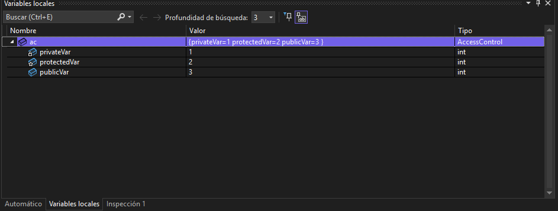
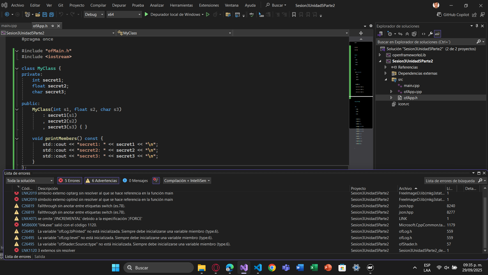
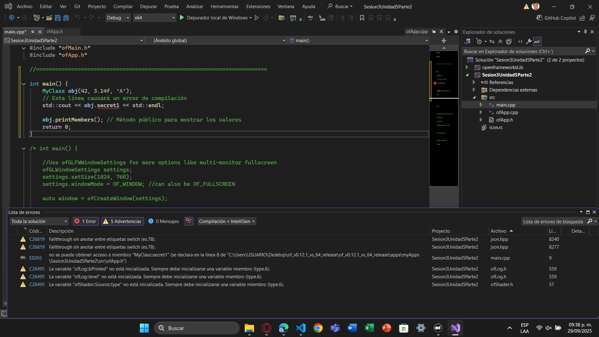
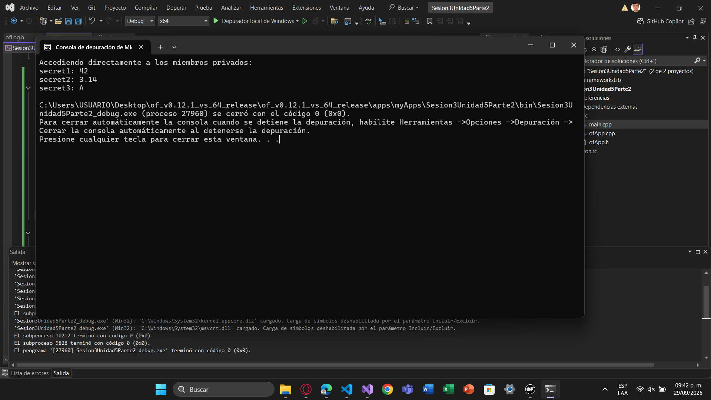
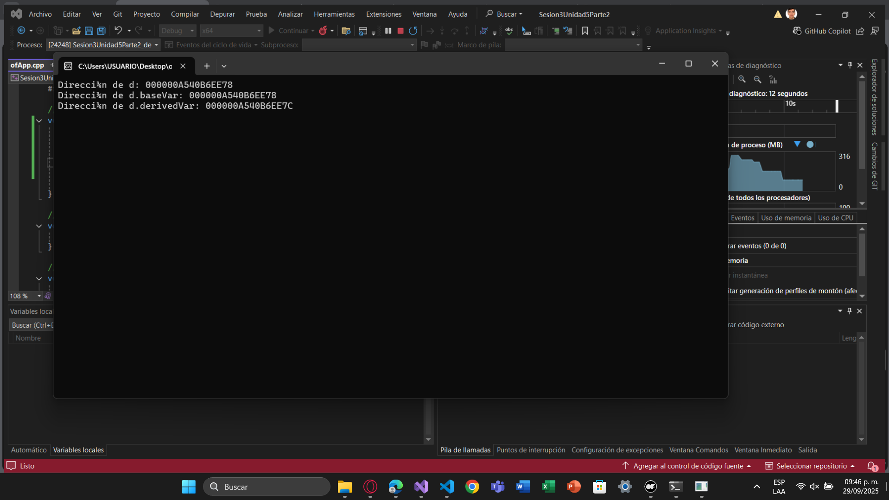
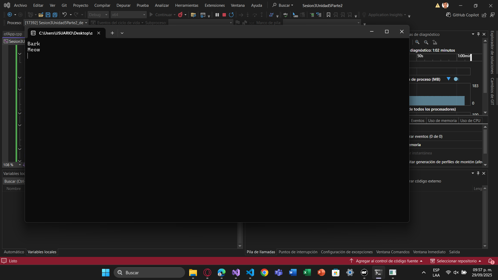

### Profundizando en el encapsulamiento

3.1 Modificadores de acceso: private, protected, public. Control de acceso: implementado por el compilador, no por restricciones en tiempo de ejecución.

- Crear una clase con diferentes niveles de acceso:

```cpp
class AccessControl {
private:
    int privateVar;
protected:
    int protectedVar;
public:
    int publicVar;
    AccessControl() : privateVar(1), protectedVar(2), publicVar(3) {}
};
```

- Intentar acceder a los miembros desde una función externa:

```cpp
int main() {
    AccessControl ac;
    ac.publicVar = 10; // Válido
    // ac.protectedVar = 20; // Error de compilación
    // ac.privateVar = 30; // Error de compilación
    return 0;
}
```
Por lo que puedo observar hasta ahora, las tres variables de int estan almacenadas en la memoria de la siguiente manera:



|Nombre|Valor|Tipo|
| --- | --- | --- |
|privateVar|1|int|
|protectedVar|2|int|
|publicVar|3|int|

> **Prompt para ChatGPT:** ¿Cómo implementa el compilador el encapsulamiento en C++? Si los miembros privados aún ocupan espacio en el objeto, ¿Qué impide que se acceda a ellos desde fuera de la clase?
>

R/ Acorde a ChatGPT, 
Un objeto en C++ es básicamente un bloque de memoria que contiene todos sus atributos (públicos, protegidos y privados). El compilador reserva espacio en memoria sin importar el nivel de acceso y aplica las reglas de acceso en tiempo de compilación.
Para ponerlo a prueba, cuando se escribe ac.privateVar en main, el compilador detecta que se esta accediendo a un miembro private desde fuera de la clase y antes de generarse un código máquina, el compilador lanza un error de compilación, lo que implica que no llega a traducir a instrucciones que lean o escriban esa parte de la memoria.
Por otra parte, los miembros privados sí ocupan espacio en memoria y lo que impide que se puedan acceder a ellos desde afuera de la clase es el compilador, debido a que bloquea el acceso directo. Como agregado, en tiempo de ejecución no hay protección real, pero acceder por otros medios no es una buena practica ya que rompe la idea de encapsulación.

### Hagamos un poco de hackers y rompamos el encapsulamiento

3.2 Considera los siguientes pasos:

 Definición de la clase: primero, define una clase con miembros privados para observar el acceso a esos miembros desde fuera de la clase.

```cpp
#include <iostream>

class MyClass {
private:
    int secret1;
    float secret2;
    char secret3;

public:
    MyClass(int s1, float s2, char s3) : secret1(s1), secret2(s2), secret3(s3) {}

    void printMembers() const {
        std::cout << "secret1: " << secret1 << "\n";
        std::cout << "secret2: " << secret2 << "\n";
        std::cout << "secret3: " << secret3 << "\n";
    }
};
```

- Intento de acceso ilegal: verifica que no se puede acceder a los miembros privados directamente utilizando el compilador:

Lo que me aparece al intentar compilar solución:



```cpp
int main() {
    MyClass obj(42, 3.14f, 'A');
    // Esta línea causará un error de compilación
    std::cout << obj.secret1 << std::endl;

    obj.printMembers();  // Método público para mostrar los valores
    return 0;
}
```

El código anterior intentará acceder directamente al miembro privado secret1, lo que resultará en un error de compilación.



- Acceso a miembros privados usando reinterpret_cast: ahora, observa cómo violar el encapsulamiento utilizando reinterpret_cast y la aritmética de punteros:

```cpp
int main() {
    MyClass obj(42, 3.14f, 'A');

    // Usando reinterpret_cast para violar el encapsulamiento
    int* ptrInt = reinterpret_cast<int*>(&obj);
    float* ptrFloat = reinterpret_cast<float*>(ptrInt + 1);
    char* ptrChar = reinterpret_cast<char*>(ptrFloat + 1);

    // Accediendo y mostrando los valores privados
    std::cout << "Accediendo directamente a los miembros privados:\n";
    std::cout << "secret1: " << *ptrInt << "\n";       // Accede a secret1
    std::cout << "secret2: " << *ptrFloat << "\n";     // Accede a secret2
    std::cout << "secret3: " << *ptrChar << "\n";      // Accede a secret3

    return 0;
}
```


Ahora reflexiona:

- ¿Qué es el encapsulamiento y cuál es su propósito en la programación orientada a objetos?
- ¿Por qué es importante proteger los datos de una clase y restringir el acceso desde fuera de la misma?
- ¿Qué significa reinterpret_cast y cómo afecta la seguridad del programa?
- ¿Por qué crees que se pudo acceder a los miembros privados de MyClass en este experimento, a pesar de que el compilador normalmente lo impediría?
- ¿Cuáles podrían ser las consecuencias de utilizar técnicas como las mostradas en este experimento en un programa real?
- ¿Qué implicaciones tiene este experimento sobre la confianza en las barreras de encapsulamiento que proporciona C++?

### Herencia y la Relación en Memoria

- Layout de memoria: ¿Cómo los objetos derivados contienen los datos de las clases base?
- Desplazamiento en memoria: los atributos de la clase base preceden a los de la clase derivada.

Considera los siguientes pasos:

3.3 Crear clases con herencia:

class Base {
public:
    int baseVar;
};
class Derived : public Base {
public:
    int derivedVar;
};
​
Analizar las direcciones de memoria:
Derived d;
std::cout << "Dirección de d: " << &d << std::endl;
std::cout << "Dirección de d.baseVar: " << &(d.baseVar) << std::endl;
std::cout << "Dirección de d.derivedVar: " << &(d.derivedVar) << std::endl;


​
¿Cómo se organizan los atributos en memoria?
¿Qué sucede si agregamos más niveles de herencia?
Prompt para ChatGPT: explícame cómo se organiza en memoria un objeto de una clase derivada en C++. ¿Cómo se almacenan los atributos de la clase base y de la derivada?

### Polimorfismo y Vtables en detalle

- Polimorfismo: permite usar una interfaz común para diferentes tipos de objetos.
- Implementación: uso de vtables para resolver métodos virtuales.

Considera los siguientes pasos:

3.4 Crear una jerarquía polimórfica:

```cpp
class Animal {
public:
    virtual void makeSound() {
        std::cout << "Some generic sound" << std::endl;
    }
};
class Dog : public Animal {
public:
    void makeSound() override {
        std::cout << "Bark" << std::endl;
    }
};
class Cat : public Animal {
public:
    void makeSound() override {
        std::cout << "Meow" << std::endl;
    }
};
```

3.4 Usar punteros de la clase base:

```cpp
Animal* animals[] = { new Dog(), new Cat() };
for (Animal* animal : animals) {
    animal->makeSound();
}
```



3.5 Analizar con un depurador: observa cómo se resuelven las llamadas a makeSound() en tiempo de ejecución.
- ¿Cómo utiliza el programa las vtables para el polimorfismo?
- ¿Cuál es el impacto en el rendimiento?
- Prompt para ChatGPT: ¿Cómo funciona el polimorfismo en C++ a nivel interno? Explica cómo se utilizan las vtables para resolver métodos virtuales en una jerarquía de herencia.

3.6 Reflexión Individual:
- ¿Cómo se implementan internamente el encapsulamiento, la herencia y el polimorfismo?
- Análisis: ventajas y desventajas en términos de eficiencia y complejidad.