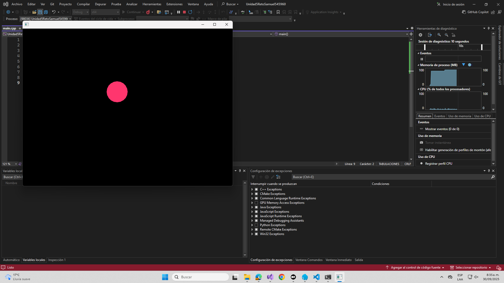
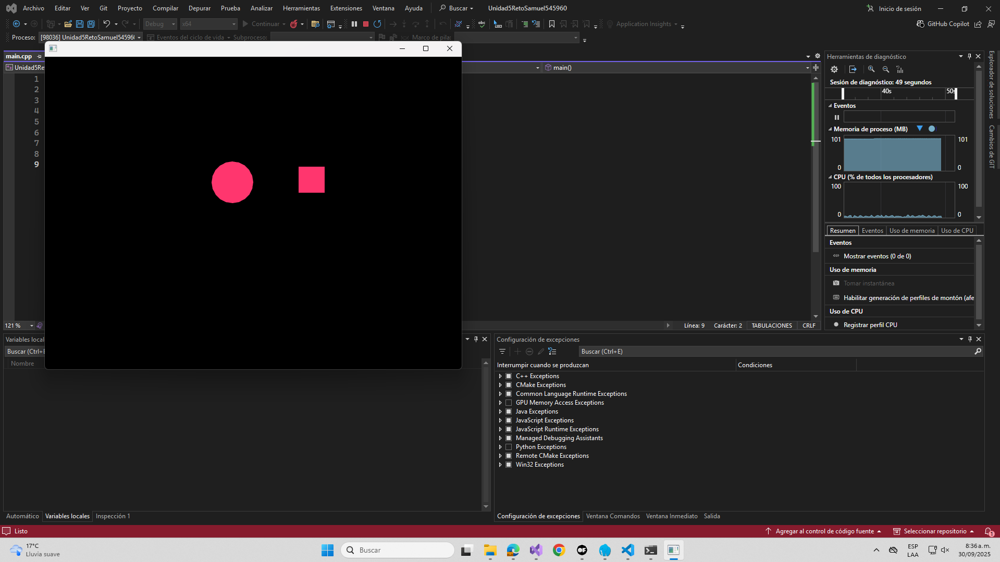
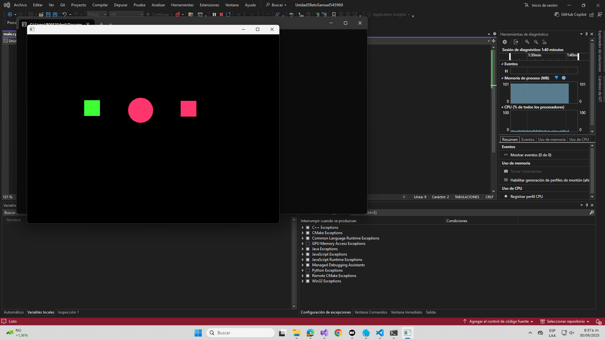
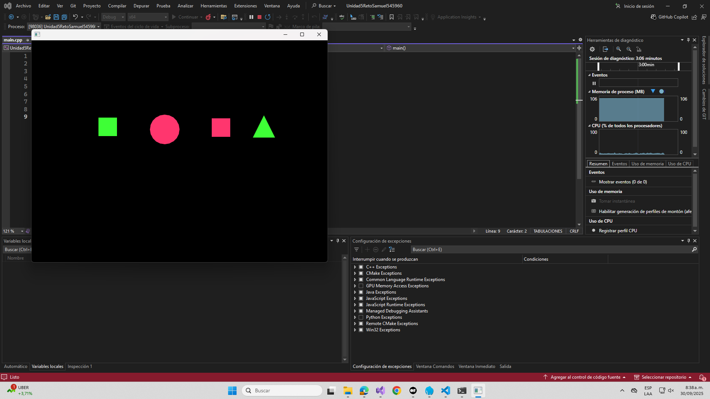
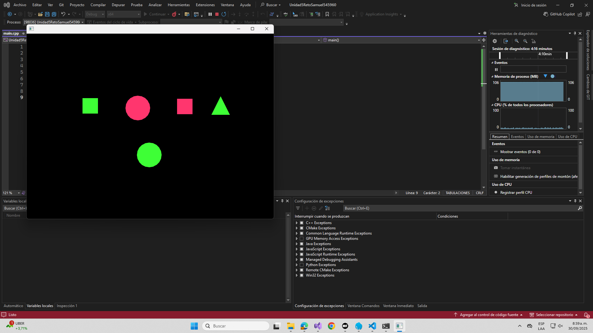
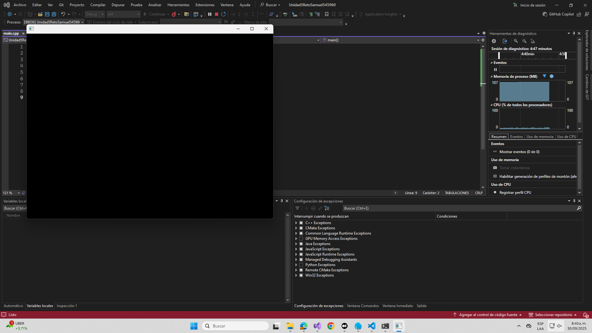
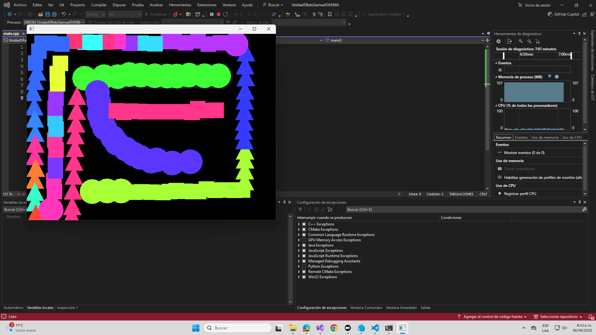

## VERSIÓN INICIAL

*Oprimir click genera una figura aleatoria, en la captura me genera un circulo rosa*

*Tecla 'f' y despues click crea un cuadrado del mismo color*

*Tecla 'c' y despues click crea un cuadradod e color diferente*

*Tecla 'f' de nuevo genera un triangulo del mismo color actual*

*Una vez más 'f', regresa al circulo*

*Tecla 'b' borra todo el lienzo*

*Obra de arte realizada por mi en base al funcionamiento del programa actual*

