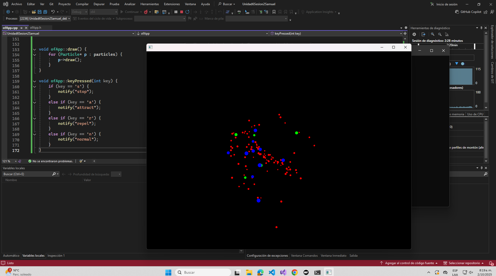
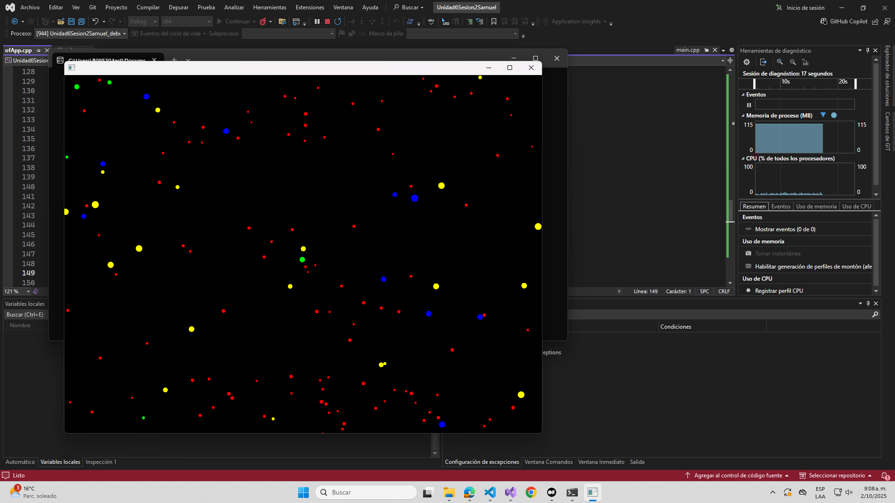
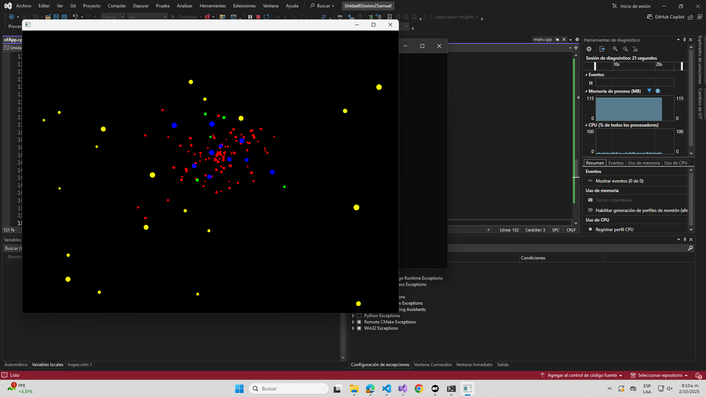

#### Ahora te pediré que te tomes un tiempo para analizar el código y entender su funcionamiento.

- ¿Qué hace el patrón observer en este caso?

R/ En este programa, cuando presiono una de las teclas, ya sea 'a' para atraer, 's' para parar, 'r' para repeler y 'n' para hacer que las particulas vuelvan a su estado original, esto notifica al programa que se esta llevando a cabo un evento. Esto es evidente en el siguiente fragmento de código:

```cpp

void ofApp::keyPressed(int key) {
    if (key == 's') {
        notify("stop");
    }
    else if (key == 'a') {
        notify("attract");
    }
    else if (key == 'r') {
        notify("repel");
    }
    else if (key == 'n') {
        notify("normal");
    }
}

```

- ¿Qué hace el patrón factory en este caso?

R/ El patrón factory puede describirse como aquel que se encarga de crear los objetos en el programa, en este caso, las particulas. En el ofApp.h se encuentra ubicado en su propia clase:

```cpp

class ParticleFactory {
public:
    static Particle* createParticle(const std::string& type);
};

```

Y si vamos al ofApp.cpp, aqui es donde se llama a la fabrica:

```cpp

Particle* ParticleFactory::createParticle(const std::string& type) {
    Particle* particle = new Particle();

    if (type == "star") {
        particle->size = ofRandom(2, 4);
        particle->color = ofColor(255, 0, 0);
    }
    else if (type == "shooting_star") {
        particle->size = ofRandom(3, 6);
        particle->color = ofColor(0, 255, 0);
        particle->velocity *= 3;
    }
    else if (type == "planet") {
        particle->size = ofRandom(5, 8);
        particle->color = ofColor(0, 0, 255);
    }
    return particle;
}


void ofApp::setup() {
    ofBackground(0);
    // Crear partículas usando la fábrica
    for (int i = 0; i < 100; ++i) {
        Particle* p = ParticleFactory::createParticle("star");
        particles.push_back(p);
        addObserver(p);
    }


    for (int i = 0; i < 5; ++i) {
        Particle* p = ParticleFactory::createParticle("shooting_star");
        particles.push_back(p);
        addObserver(p);
    }

    for (int i = 0; i < 10; ++i) {
        Particle* p = ParticleFactory::createParticle("planet");
        particles.push_back(p);
        addObserver(p);
    }

}

```

- ¿Qué hace el patrón state en este caso?

R/ El patrón state lo que hace es alterar el comportamiento de las particulas si se altera el estado interno.

```cpp

void Particle::onNotify(const std::string& event) {
    if (event == "attract") {
        setState(new AttractState());
    }
    else if (event == "repel") {
        setState(new RepelState());
    }
    else if (event == "stop") {
        setState(new StopState());
    }
    else if (event == "normal") {
        setState(new NormalState());
    }
}

```

### Experimenta con el código y realiza algunas modificaciones para entender mejor su funcionamiento. Por ejemplo:

- Adiciona un nuevo tipo de partícula.

```cpp
    else if (type == "sunshine") {
        particle->size = ofRandom(3, 8);
        particle->color = ofColor(255, 255, 0);
    }
```


```cpp
    for (int i = 0; i < 20; ++i) {
        Particle* p = ParticleFactory::createParticle("sunshine");
        particles.push_back(p);
        addObserver(p);
    }
```

Y si comento el addObserver(p), las particulas "sunshine" no seguiran las notificaciones del programa:



- Adiciona un nuevo estado.

R/

- Modifica el comportamiento de las partículas.

R/

- Crea otros eventos para notificar a las partículas.

R/