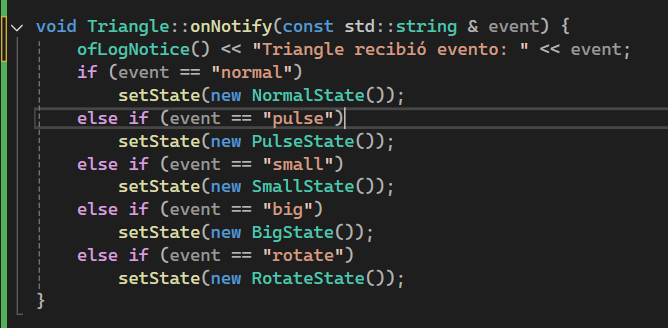

## Pruebas cualitativas (sugeridas por ChatGPT)

1.1 Funcionamiento adecuado de los eventos suscritos (Rotar, Agrandar, Achicar, Normal y Pulso)

R = Rotar/Rotate
A = Agrandar/Big
S = Achicar/Small
N = Normal
P = Pulso/Pulse

<video controls src="20251009-0248-35.3139434.mp4" title="Title"></video>

1.2 Agregar un log para verificar que si se este cumpliendo los eventos.

```cpp
void Triangle::onNotify(const std::string & event) {
	ofLogNotice() << "Triangle recibió evento: " << event;
	if (event == "normal")
		setState(new NormalState());
	else if (event == "pulse")
		setState(new PulseState());
	else if (event == "small")
		setState(new SmallState());
	else if (event == "big")
		setState(new BigState());
	else if (event == "rotate")
		setState(new RotateState());
}
```



<video controls src="20251009-0257-12.4464699.mp4" title="Title"></video>