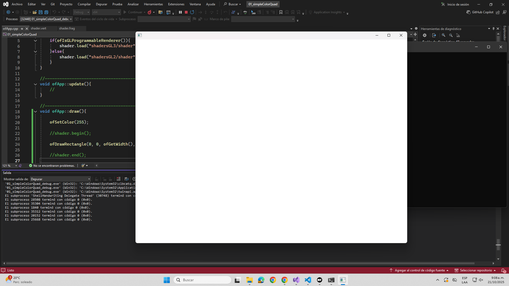
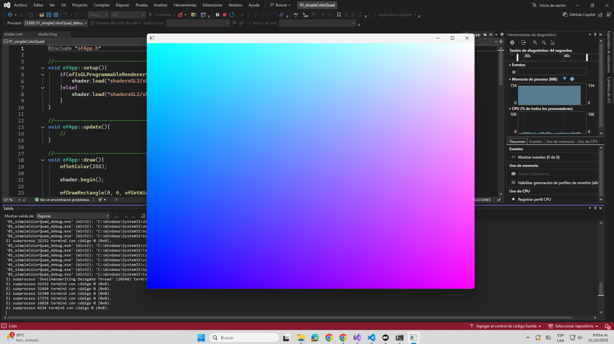

### Actividad 2

Comienza realizando la lectura de la introducción del tutorial [Introducing Shaders](https://openframeworks.cc/ofBook/chapters/shaders.html). Realiza la sección Your First Shader, pero antes de ejecutar el código, realiza un pequeño experimento. Modifica ligeramente el método draw:

```cpp
void ofApp::draw(){
    ofSetColor(255);

    //shader.begin();

    ofDrawRectangle(0, 0, ofGetWidth(), ofGetHeight());

    //shader.end();
}
```

Observa la salida.



Ahora ejecuta el código original. Analiza los resultados y responde:

- ¿Cómo funciona?

R/ El programa dibuja por completo la pantalla con un recntagulo de colores degradados que van desde el cian hasta el rosado por medio de shaders cargados.

- ¿Qué resultados obtuviste?



- ¿Estás usando un vertex shader?

R/ 

```cpp
OF_GLSL_SHADER_HEADER

uniform mat4 modelViewProjectionMatrix;

in vec4 position;

void main(){
	gl_Position = modelViewProjectionMatrix * position;
}
```

- ¿Estás usando un fragment shader?

R/

```cpp
OF_GLSL_SHADER_HEADER

out vec4 outputColor;

void main()
{
    // gl_FragCoord contains the window relative coordinate for the fragment.
    // we use gl_FragCoord.x position to control the red color value.
    // we use gl_FragCoord.y position to control the green color value.
    // please note that all r, g, b, a values are between 0 and 1.
    
    float windowWidth = 1024.0;
    float windowHeight = 768.0;
    
	float r = gl_FragCoord.x / windowWidth;
	float g = gl_FragCoord.y / windowHeight;
	float b = 1.0;
	float a = 1.0;
	outputColor = vec4(r, g, b, a);
}
```

- Analiza el código de los shaders. ¿Qué hace cada uno?

R/ El vertex shader multiplica la matriz de proyección con la posición, mientras que fragment shader es la que se encarga de asignar el color al objeto, en el ejemplo de esta actividad se puede observar que hay un r, g, b, a. Aqui, X se divide las coordenadas de x con el ancho, Y con las coordenadas de y y el alto, y b y a se mantienen en el valor maximo (1.0), a diferencia de lo que hemos visto en unidades pasadas en donde el valor maximo era 255, aqui es 1.0 debido a que es en decimales.

