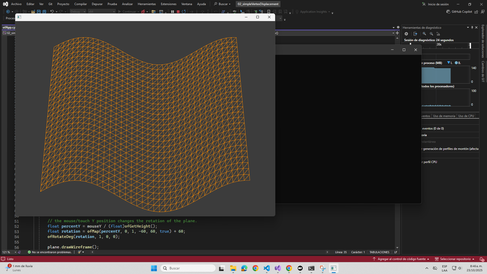
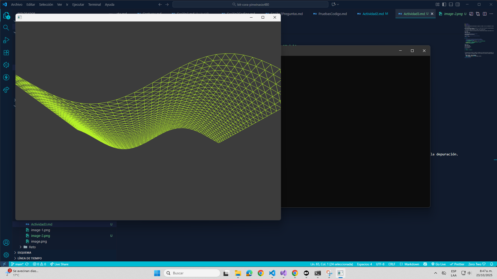

### Actividad 3

#### Adding Uniforms

Ahora vas a pasar información personalizada de tu programa a los shaders. Vas a leer con detenimiento el tutorial Adding Uniforms.

- ¿Qué es un uniform?

R/ Un uniform dentro del contexto de la aplicación, es un método necesario para pasarle el tiempo transcurrido para la anmación de la onda sinusocial. Además de pasar el valor de tiempo al sombreador.

- ¿Cómo funciona el código de aplicación, los shaders y cómo se comunican estos?

R/ El código de la aplicación crea un objeto 3D al que se le define colores y posiciones y para procesar los vertices y pixeles, llama a los shaders. 

Vertex shader:
```cpp
OF_GLSL_SHADER_HEADER

// these are for the programmable pipeline system
uniform mat4 modelViewProjectionMatrix;
in vec4 position;

// the time value is passed into the shader by the OF app.
uniform float time;


void main()
{
    // the sine wave travels along the x-axis (across the screen),
    // so we use the x coordinate of each vertex for the calculation,
    // but we displace all the vertex along the y axis (up the screen)/
    float displacementHeight = 100.0;
    float displacementY = sin(time + (position.x / 100.0)) * displacementHeight;
	
    vec4 modifiedPosition = modelViewProjectionMatrix * position;
	modifiedPosition.y += displacementY;
	gl_Position = modifiedPosition;
}
``` 
Fragment shader:
```cpp
OF_GLSL_SHADER_HEADER

uniform vec4 globalColor;

out vec4 outputColor;
 
void main()
{
    outputColor = globalColor;
}

```

Y la aplicación pasa los uniforms a los shaders, los shaders usan los valores para calcular las posiciones o colores y el resultado se muestra en la depuración.

- Modifica el código de la actividad para cambiar el color de cada uno de los píxeles de la pantalla personalizando el fragment shader.

```cpp
	ofColor colorLeft = ofColor::greenYellow;
	ofColor colorRight = ofColor::darkOrange;
	ofColor colorMix = colorLeft.getLerped(colorRight, percentX);
	ofSetColor(colorMix);
```


