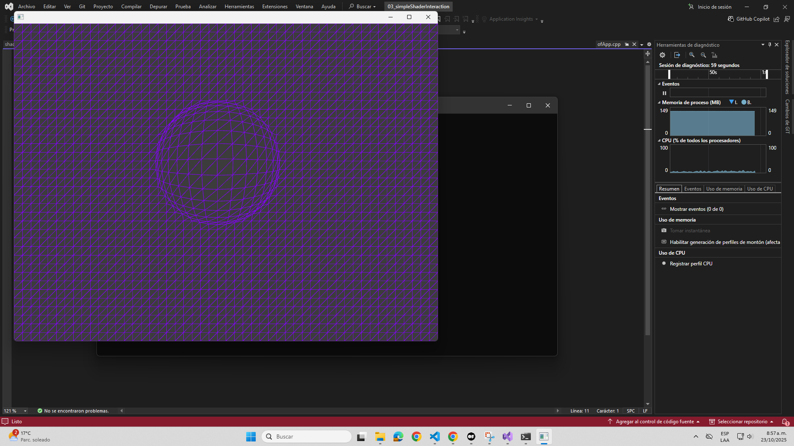
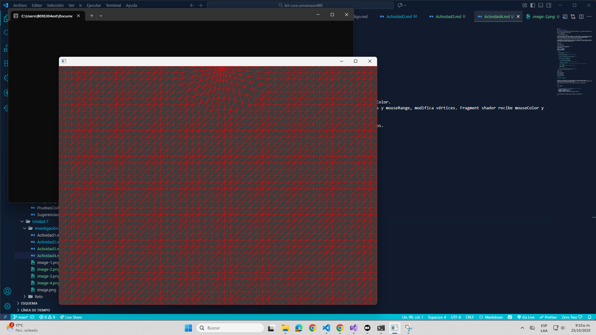
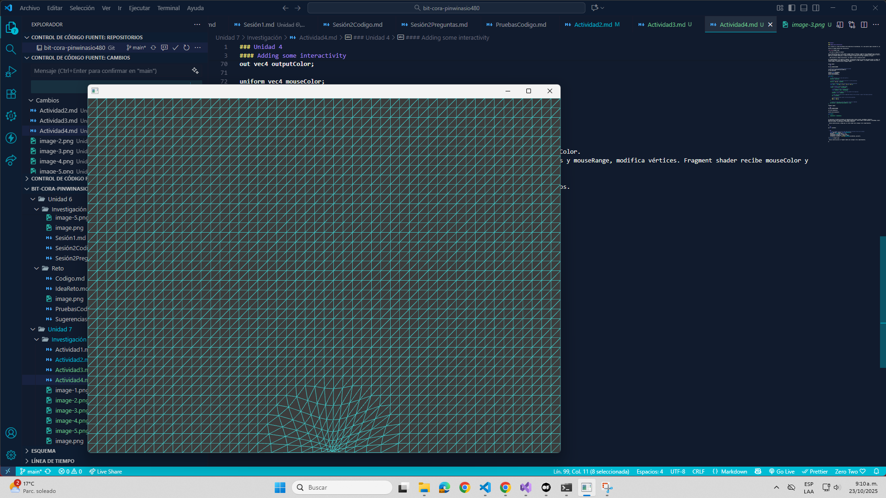
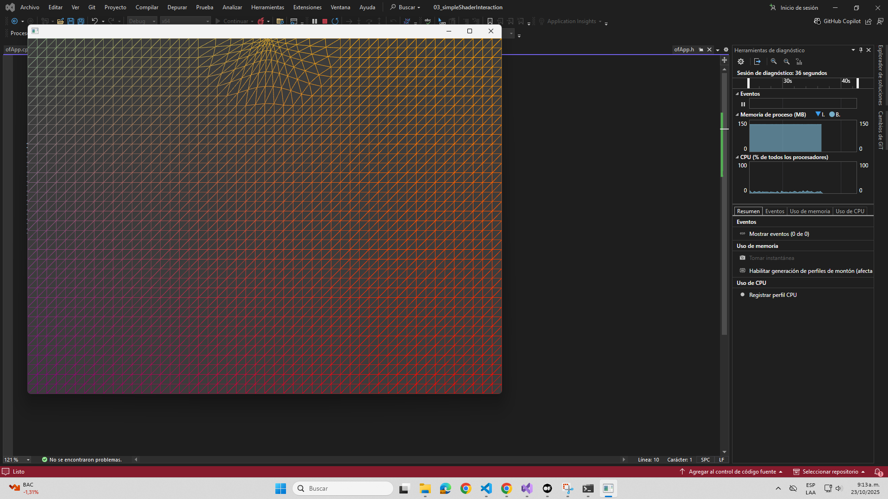
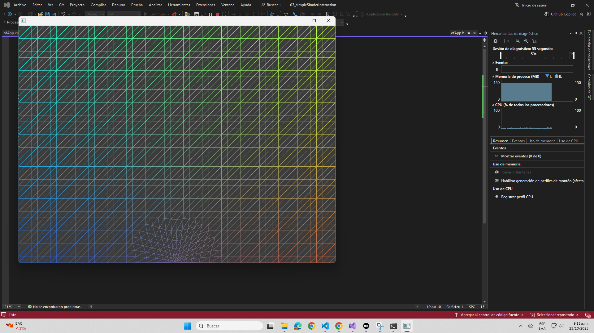

### Unidad 4

#### Adding some interactivity

Vas a realizar la última actividad de esta experiencia de aprendizaje. Yo sé que quieres seguir haciendo más, pero tenemos un tiempo muy limitado.

Analiza el ejemplo Adding some interactivity.



- ¿Qué hace el código del ejemplo?

R/ El código permite que un plano 2D/3D (llamado plane) se deforme y cambie de color dependiendo de la posición del mouse. La posición del mouse se pasa al vertex shader y se usa para mover los vértices cercanos al mouse. Al mismo tiempo, el fragment shader cambia el color de la figura según la posición horizontal del mouse. Esto crea un efecto interactivo: la malla se "empuja" y cambia de color según dónde esté el mouse.

- ¿Cómo funciona el código de aplicación, los shaders y cómo se comunican estos?

R/ En OpenFrameworks (y en general en OpenGL): La aplicación calcula los valores que quieres pasar al shader (ej. posición del mouse, colores, rangos). Se usan uniforms para enviar estos datos desde la CPU (aplicación) a la GPU (shader). Los shaders reciben estos datos y usan esa información para modificar vértices (vertex shader) o pixeles/colores (fragment shader).


Vertex shader:
```cpp

OF_GLSL_SHADER_HEADER

// these are for the programmable pipeline system
uniform mat4 modelViewProjectionMatrix;
in vec4 position;

uniform float mouseRange;
uniform vec2 mousePos;
uniform vec4 mouseColor;

void main()
{
    // copy position so we can work with it.
    vec4 pos = position;
    
    // direction vector from mouse position to vertex position.
	vec2 dir = pos.xy - mousePos;
    
    // distance between the mouse position and vertex position.
	float dist =  sqrt(dir.x * dir.x + dir.y * dir.y);
    
    // check vertex is within mouse range.
	if(dist > 0.0 && dist < mouseRange) {
		
		// normalise distance between 0 and 1.
		float distNorm = dist / mouseRange;
        
		// flip it so the closer we are the greater the repulsion.
		distNorm = 1.0 - distNorm;
		
        // make the direction vector magnitude fade out the further it gets from mouse position.
        dir *= distNorm;
        
		// add the direction vector to the vertex position.
		pos.x += dir.x;
		pos.y += dir.y;
	}

	// finally set the pos to be that actual position rendered
	gl_Position = modelViewProjectionMatrix * pos;
}
```
Fragment shader:

```cpp
OF_GLSL_SHADER_HEADER

out vec4 outputColor;

uniform vec4 mouseColor;
 
void main()
{
    outputColor = mouseColor;
}
```

La aplicacion se comunica enviando los siguientes datos: mouseX, mouseY, mouseRange, mouseColor.
Aplicación pasa estos valores al shader usando setUniformX(). Vertex shader recibe mousePos y mouseRange, modifica vértices. Fragment shader recibe mouseColor y pinta los píxeles. La GPU dibuja el resultado en pantalla.

- Realiza modificaciones a ofApp.cpp y al vertex shader para conseguir otros comportamientos.

R/

```cpp
dir *= -distNorm;
```

```cpp
	// color changes from red to cyan when moving the mouse from top to bottom
	float percentY = mouseY / (float)ofGetWidth();
	percentY = ofClamp(percentY, 0, 1);
	ofFloatColor colorTop = ofColor::red;
	ofFloatColor colorBottom = ofColor::cyan;
	ofFloatColor colorMix = colorTop.getLerped(colorBottom, percentY);
```




- Realiza modificaciones al fragment shader para conseguir otros comportamientos.

R/

```cpp
    // normalizar coordenadas de 0 a 1
    vec2 uv = gl_FragCoord.xy / vec2(800.0, 600.0); // reemplaza 800x600 por tu resolución
    
    // mezclar color del mouse con gradiente según la posición
    vec4 color = mix(mouseColor, vec4(uv, 1.0 - uv.x, 1.0), 0.5);
    
    outputColor = color;
```


