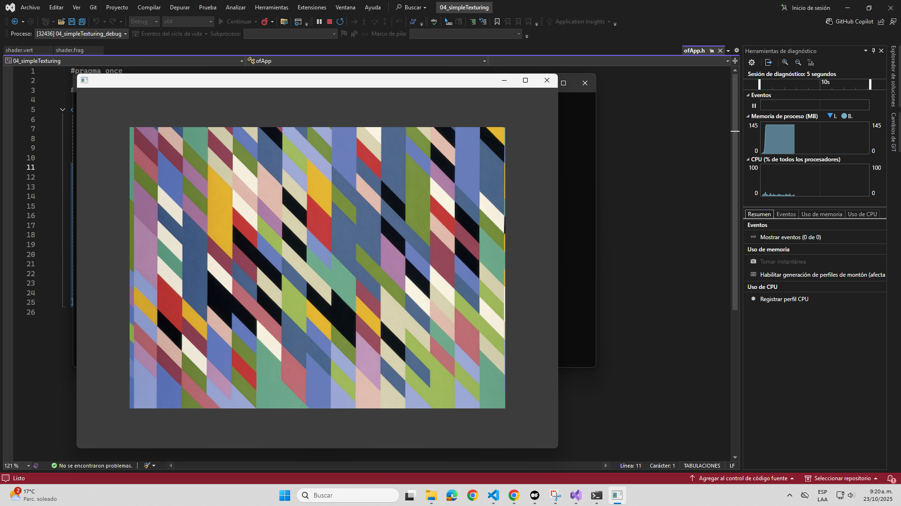
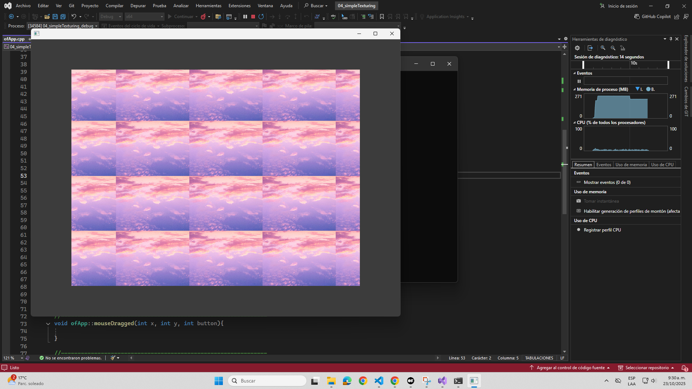
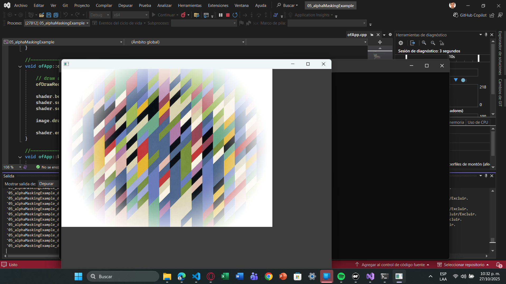
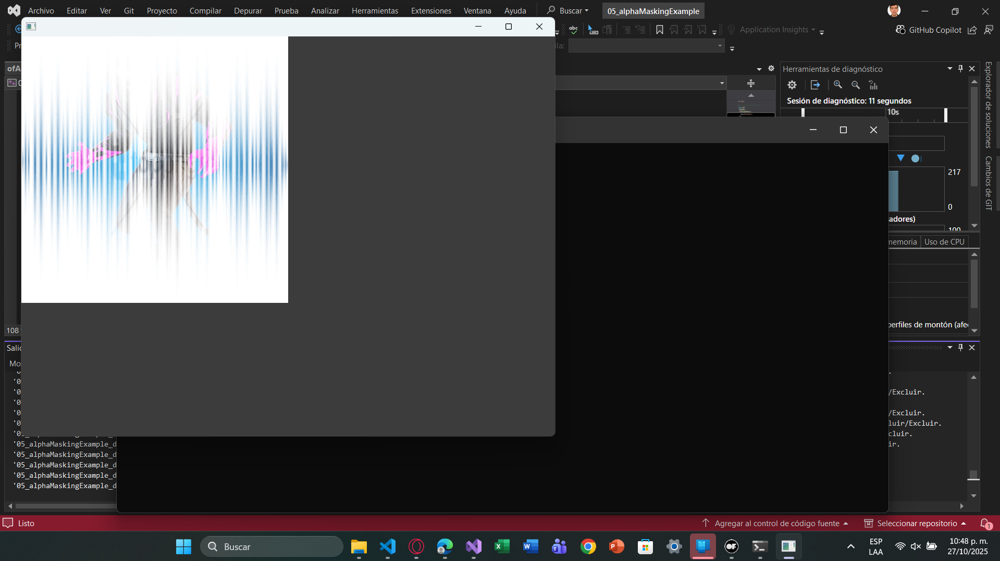
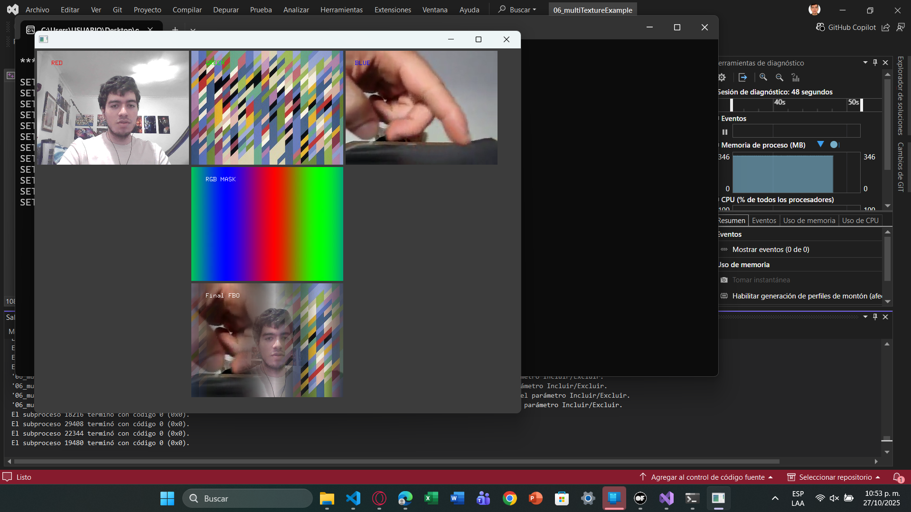
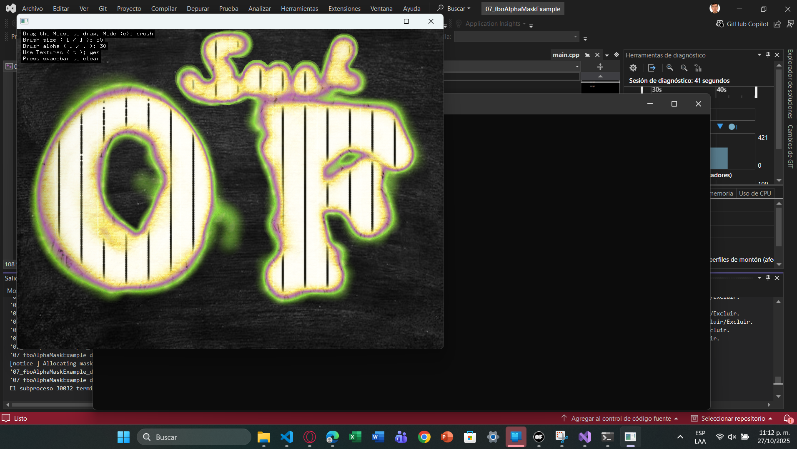
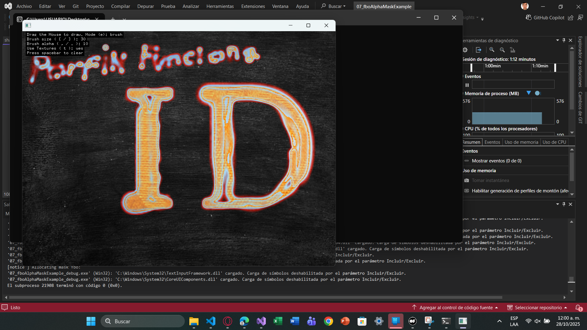

#### Adding textures

Imagen original:



Imagen personalizada



#### Alpha Masking

Original: 



Modificada:



```cpp

void ofApp::setup(){
	ofDisableArbTex();
	if(ofIsGLProgrammableRenderer()){
		shader.load("shadersGL3/shader");
	}else{
		shader.load("shadersGL2/shader");
	}

	image.load("meow.jpg");
	imageMask.load("blue_mask.png");
}

//--------------------------------------------------------------
void ofApp::update(){

}

//--------------------------------------------------------------
void ofApp::draw(){
	
	// draw a white rectangle for background.
	ofDrawRectangle(0, 0, image.getWidth(), image.getHeight());
	
	shader.begin();
	shader.setUniformTexture("imageMask", imageMask.getTexture(), 1);
	shader.setUniform2f("resolution", image.getWidth(), image.getHeight());

	image.draw(0, 0);
	
	shader.end();
}
``` 

#### Multiple Textures

Original:



Modificada:

https://upbeduco-my.sharepoint.com/:v:/g/personal/samuel_gomeze_upb_edu_co/ES67yCI2mdpBl_qS3VuMIe8BJplxuIiJ47YXH2bSgZO8SQ

#### ofFbo

Original:



Modificada:



#### Textures as Data (e.g. Displacement)

Original:

Modificada:

#### Blurring

Original:

Modificada:

#### The End, Congrats!