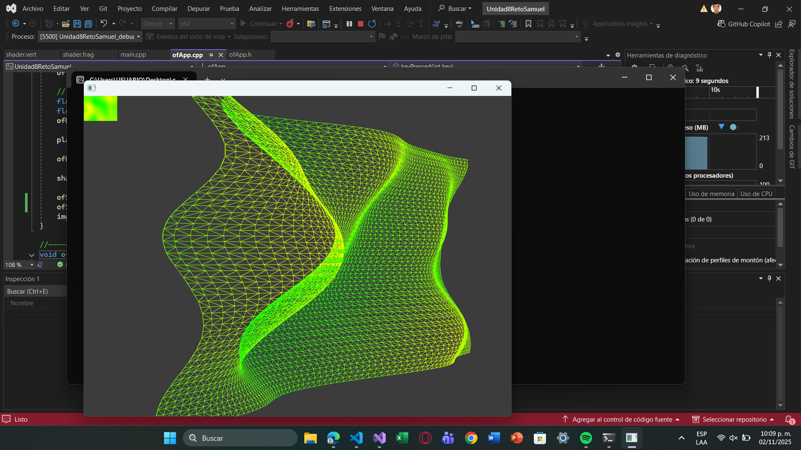
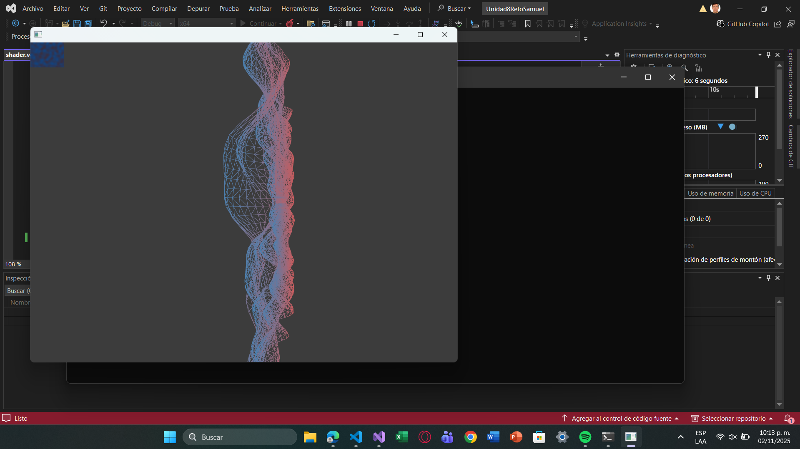

- Explica y muestra cómo probaste la aplicación en ofApp.cpp.

En el offapp.cpp para probar las modificaciones del ejemplo 8, y que si sirviera las modificaciones, modifique los valores percent y mouse Y a X, además de modificar el valor de rotation, ya que al cambiarlo de 1, 0, 0; a 0, 1, 0; cambia la dirección a la que gira el plano.

```cpp
	// the mouse/touch X position changes the rotation of the plane.
	float percentX = mouseX / (float)ofGetHeight();
	float rotation = ofMap(percentX, 0, 0.9, -40, 40, true) + 40;
	ofRotateDeg(rotation, 0, 1, 0);
```

Y con el color probe editando esta parte con diferentes colores:

```cpp
	for (int y = 0; y < h; y++) {
		for (int x = 0; x < w; x++) {
			int i = y * w + x;
			float noiseValue = ofNoise(x * noiseScale, y * noiseScale, noiseVel);
			ofColor c1 = ofColor::indianRed;
			ofColor c2 = ofColor::blueSteel;
			ofColor mixed = c1.getLerped(c2, noiseValue); // mezcla según ruido
			pixels.setColor(x, y, mixed);
		}
	}
```
Además de agregar editar/agregar esto en draw():

```cpp
	ofSetColor(ofColor::indianRed);
	ofSetColor(ofColor::blueSteel);
```

Acontinuación adjunto de como se ve el plano al cambiar los colores a green y yellow: 



- Explica y muestra cómo probaste el vertex shader.

Nuevamente, aqui fue copiar y pegar el código de la modificación pasada.

```cpp
    // here we get the red channel value from the texture
    // to use it as vertical displacement
    float displacementX = texture(tex0, texcoord).r;

    // use the displacement we created from the texture data
    // to modify the vertex position
	modifiedPosition.x += displacementX * scale;
```

Aqui modifique modifiedPosition.y a X al igual que displacement para probar como se veian las ondas al cambiar la rotación del plano.

Y la misma cantidad y nivel de ondas lo probe con esto: 

```cpp
  float scale = 400.;
```

A menor cantidad las ondas son más pequeñas o no tan fuertes, aqui dejo adjunto como se ve si cambio la cantidad a 200:




- Explica y muestra cómo probaste el fragment shader.

En este apartado no probe gran cosa, debido a que fue copiar y pegar el de la versión modificada que habia hecho anteriormente para que leyera colores que no fuera escala de grises.

```cpp
void main()
{
    //outputColor = texture(tex0, texCoordVarying);
	 vec4 texColor = texture(tex0, texCoordVarying);
    outputColor = texColor; // ya contiene el color indianRed modulado por ruido
}
```

- Explica y muestra cómo probaste toda la aplicación completa.

Ya con todos los códigos integrados, fue cuestión de depurar el programa y ver que tal aparecia, asi mismo, hice todas las modificaciones en conjunto como mencione anteriormente.