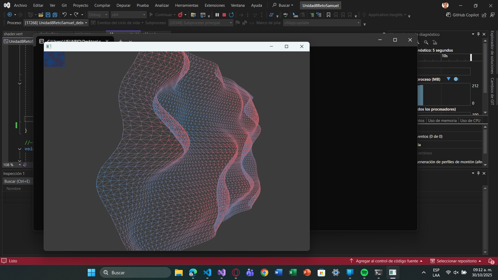

### Explicación reto

Versión del ejemplo 8, solo que en lugar de las ondas elevarse de forma vertical al igual que el plano, este se hace de forma horizontal. (las configuraciones de X y Y se invierten). Asi mismo, el plano tiene dos colores: Indian Red y Blue Steel. Al igual que en las unidades pasadas en donde hicimos un objeto 3D en donde dependiendo de la posición de la onda, el color cambia, mientras más alto es rojo, y más bajo es azul.

### ¿Como envia los datos la CPU a la GPU?

- Los shaders no son debido a que estos si bien reciben los datos, no muestra como se envian desde la CPU.

- Los datos se envian en offapp.cpp desde la siguiente linea de código:

```cpp

img.update();

```

Lo primero que sucede antes, es que cuando utilizo en la función update:

```cpp

ofPixels & pixels = img.getPixels();

```
Se obtiene una refencia a los píxeles que estan en la memoria de la CPU, y más adelante con ayuda de los dos for: 

```cpp

	for (int y = 0; y < h; y++) {
		for (int x = 0; x < w; x++) {
			int i = y * w + x;
			float noiseValue = ofNoise(x * noiseScale, y * noiseScale, noiseVel);
			ofColor c1 = ofColor::indianRed;
			ofColor c2 = ofColor::blueSteel;
			ofColor mixed = c1.getLerped(c2, noiseValue); // mezcla según ruido
			pixels.setColor(x, y, mixed);
		}
	}

```

Los pixeles se modifican con: 

```cpp

pixels.setColor(x, y, mixed);

```

Hasta ahi no pasa nada relevante, pues la CPU altera los datos de los colores (en este caso, el ruido de colores de Indian Red y Blue Steel), pero esto no lo sabe la GPU debido a que las modificaciones en los pixeles no estan sincronizados.

Apartir de aqui, es donde empieza la transferencia de datos. Con la linea de update que mencione al inicio, lo que hace openFrameworks es sincronizar las texturas de la GPU con los datos de los píxeles de la CPU.

Y cuando se hace el update, la textura ya está cargada en la GPU.

Y en draw() cuando hago:

```cpp

	img.getTexture().bind();

    plane.drawWireframe();

    img.draw(0, 0);

```
La GPU usa su propia copia de los datos (textura) para renderizarla en pantalla, directa o dentro del shader.

### Captura del programa



### Enlace a video reto

https://upbeduco-my.sharepoint.com/:v:/g/personal/samuel_gomeze_upb_edu_co/EbfDVoCixDtKingXGclC4XEBF3eLMByKmxB63cwozw0kEg